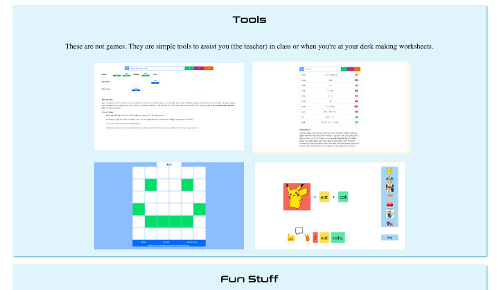

# [TEFL Assistant Web Site](https://teflassistant.com)
A web site for TEFL teachers.

## Purpose/Goal
To share with other TEFL teachers useful games, tools, and links that I've built and used for/with my own lessons.

## Operation
Click on the links to play a game, use a tool or visit a helpful site for English teaching materials.

## Tech/Libraries Used
* HTML
* CSS
* JavaScript
* React
* AWS
    * Route 53
    * S3
    * Lightsail
* Let's Encrypt (SSL)

## Problems/Solutions
* The biggest problem was learning how to set up SSL. I tried using CloudFront (AWS) but then I ended up using Let's Encrypt instead.
* The Lightsail platform took a while to adapt to, but it proved to be easier, and cheaper, in the end.
* The Apache server that runs in the bitnami instance was a pain because it was running quietly in the background and I had to learn how to get around using that. I ended up stopping it so I could run my Node server instead.

## More Information
[Color Palette](https://www.paletton.com/#uid=33q0u0k7UUa3cZA5wXlaiQ5cFL3)
